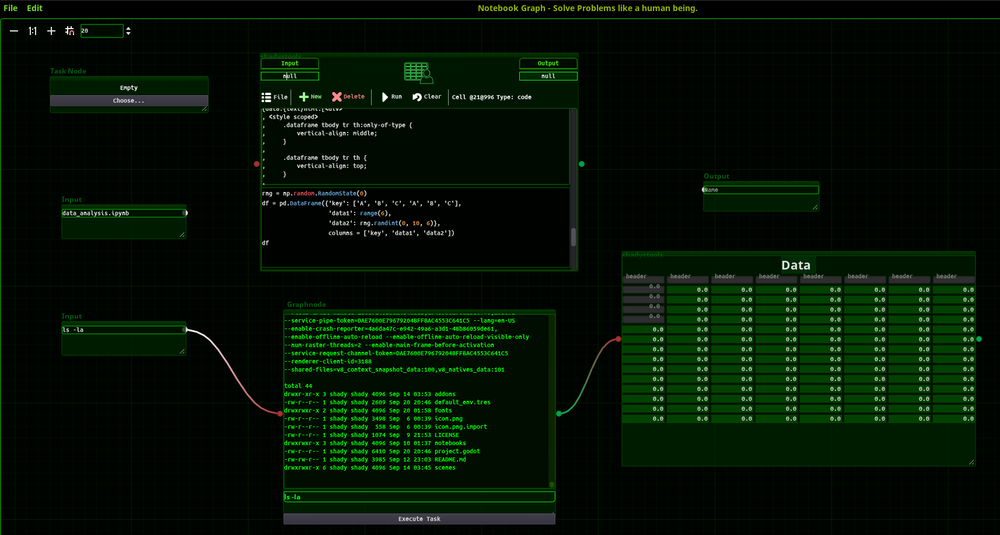
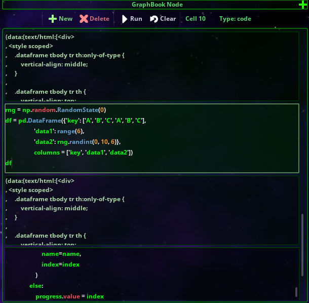
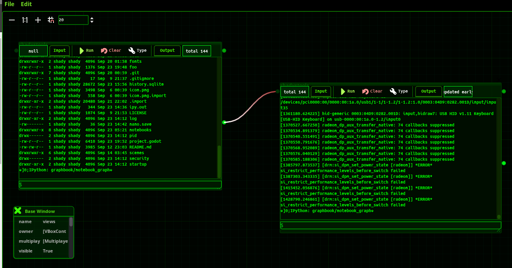

# Graph-based Jupyter notebook frontend for Godot Game Engine

## Computing at Speed of Human:

* Creators need immediate feedback: Modify functionality by manipulating the visualization or live edit the source code to see the results instantly.
* Solve bigger problems: Abstract and organize arbitrarily large chunks of functionality into graphnode networks.
* Build your toolbox: Customize a toolbox of nodes to perform domain-specific computation. Create automated workflows, monitoring dashboards, data analysis or... anything really. 
* Use your whole brain:  Different reprentations of knowledge are processed by different parts of the brain. Seemlessly cycle graphnode tools between visual and symbolic(code) representations.

### Solve bigger problems:
* The limiting factor on the most complex systems is human understanding.
* Use a graph structure to design and manage a network of nodes and control flows.
* Design models of systems and simulate changes. 
* Construct automated data collection and analysis pipelines that have high levels of flexability and debugability.

### Creators Need Immediate Feedback
* (Life is too short for static UML diagrams). Diagram your architure and hit run. 
* A custom Jupyter frontend lets users safely write and execute code in over 100 languages within a running godot project.
* Each Jupyter notebook acts as an independent entity(engine) which may be connected to arbitrary graphnodes in a scene.
* Jupter Kernels decouple the execution of live-code from godot engine. 

### Use your whole brain:
Each component has multiple views the user can cycle throuh for viewing and editing nodes. 
*  **Visual:**
    * Auto-generated GUI from unmodified source-code, objects, or JSON files. 
    * Handcrafted iconographic, GUI, animations
    * A variety of implementations of drag-and-drop / resizable windows in Godot.
    * Visually identify the sorce bottlenecks/bugs 
*  **Symbolic** (Code/Text)  
    * View/Edit the source code or data directly in a simple integrated text editor or via external IDE.
    * A fancy retro green terminal theme to remind you its a computer. Go outside.
*  **Audio/Kinesthetic** representions???
    * Help make new ways to think about information. Contribute!

### Build your toolbox: 
* **Engine:** 
    * Write/execute arbitrary blocks of code that process inputs and make outputs. 
    * They can be triggered manually or activated automatically via requests from connected nodes. 
    * Currently support jupyter notebooks, bash scripts, gdscript or local executables. 
* **Gasket:**
    * Ensure engines can communicate safely with other graphnodes.   
    * Validation of developer defined type-checking/contract/SLA systems for each connected node. 
* **Probe**
    * stat collection and monitoring for violation contract violations
    * auto-profile nodes to determine bottlenecks
* **Valve:**
    * rate-limit a nodes input or output to make sure SLA's for each node can be met. 
    * divert inputs/output to a queue/tank
* **Tank**
    * Queue inputs or outputs ofincoming or outgoing requests.

### Why Jupyter + Godot?
The goal of this Jupyter Frontend is for the workflow system, but other uses might include: 
* Godot 2d/3d/VR engines for high-quality data visualizations.
* In-game dynamic generation of text, image, audio and video content.
* Create detailed live web-based dashboards for server monitoring and admin.
* Seamlessly pull data from a wide variety of sources into games/simulations.
* Generate, store, modify gameworlds/savegames both in-game and in-browser.
* Rapidly design starting parameters of simulations in Godot and then run them in Jupyter. 

## Requirements!
* A Jupyter kernel must separately installed on a linux system (try anaconda to install it). Windows support is possible, do it! 
* Notebooks can only be processed with jupyter-nbconvert as one-shot on the local system.  Help implementing the full network API is appreciated. 

- =a tool by al shady =-
